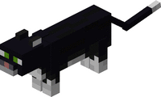

<!--
*** Thanks for checking out this README Template. If you have a suggestion that would
*** make this better, please fork the repo and create a pull request or simply open
*** an issue with the tag "enhancement".
*** Thanks again! Now go create something AMAZING! :D
***
***
***
*** To avoid retyping too much info. Do a search and replace for the following:
*** github_username, repo, twitter_handle, email
-->


<!-- PROJECT SHIELDS -->
<!--
*** I'm using markdown "reference style" links for readability.
*** Reference links are enclosed in brackets [ ] instead of parentheses ( ).
*** See the bottom of this document for the declaration of the reference variables
*** for contributors-url, forks-url, etc. This is an optional, concise syntax you may use.
*** https://www.markdownguide.org/basic-syntax/#reference-style-links
-->
[](https://github.com/dixiatielu/BetterCat/graphs/contributors)
[](https://github.com/dixiatielu/BetterCat/network/members)
[](https://github.com/dixiatielu/BetterCat/stargazers)
[](https://github.com/dixiatielu/BetterCat/issues)
[](https://github.com/dixiatielu/BetterCat/blob/master/LICENSE.txt)
[](https://linkedin.com/in/dixiatielu)


<!-- PROJECT LOGO -->
<br />
<p align="center">
  <a href="https://github.com/dixiatielu/BetterCat">
    
  </a>

  <h3 align="center">Better Cat</h3>

  <p align="center">
    A Mod for Minecraft 1.12.2
    <br />
    <a href="https://github.com/dixiatielu/BetterCat"><strong>Explore the docs »</strong></a>
    <br />
    <br />
    <a href="https://github.com/dixiatielu/BetterCat">View Demo</a>
    ·
    <a href="https://github.com/dixiatielu/BetterCat/issues">Report Bug</a>
    ·
    <a href="https://github.com/dixiatielu/BetterCat/issues">Request Feature</a>
  </p>
</p>


<!-- TABLE OF CONTENTS -->
## Table of Contents

* [About the Project](#about-the-project)
  * [Built With](#built-with)
* [Getting Started](#getting-started)
  * [Prerequisites](#prerequisites)
  * [Installation](#installation)
* [Usage](#usage)
* [Roadmap](#roadmap)
* [Contributing](#contributing)
* [License](#license)
* [Contact](#contact)
* [Acknowledgements](#acknowledgements)


<!-- ABOUT THE PROJECT -->
## About The Project

[](https://github.com/dixiatielu/BetterCat)

<!-- Here's a blank template to get started:
**To avoid retyping too much info. Do a search and replace with your text editor for the following:**
`github_username`, `repo`, `twitter_handle`, `email` -->


### Built With

* []()
* []()
* []()


<!-- GETTING STARTED -->
## Getting Started

To get a local copy up and running follow these simple steps.

### Prerequisites
JDK8 envionment
Forge Installed
Minecraft 1.12.2
### Installation

```bash
git clone https://github.com/dixiatielu/BetterCat.git
cd BetterCat
./gradlew build
```
###### Or you could also [download the released .jar file](https://github.com/dixiatielu/BetterCat/releases)
Then copy the .jar file to your .minecraft/mods directory.

And enjoy your game!
<!-- USAGE EXAMPLES -->
## Usage

<!-- Use this space to show useful examples of how a project can be used. Additional screenshots, code examples and demos work well in this space. You may also link to more resources. -->

_For more examples, please refer to the [Documentation](https://github.com/dixiatielu/BetterCat/wiki)_


<!-- ROADMAP -->
## Roadmap

See the [open issues](https://github.com/dixiatielu/BetterCat/issues) for a list of proposed features (and known issues).


<!-- CONTRIBUTING -->
## Contributing

Contributions are what make the open source community such an amazing place to be learn, inspire, and create. Any contributions you make are **greatly appreciated**.

1. Fork the Project
2. Create your Feature Branch (`git checkout -b feature/AmazingFeature`)
3. Commit your Changes (`git commit -m 'Add some AmazingFeature'`)
4. Push to the Branch (`git push origin feature/AmazingFeature`)
5. Open a Pull Request


<!-- LICENSE -->
## License

Distributed under the MIT License. See `LICENSE` for more information.


<!-- CONTACT -->
## Contact

dixiatielu - [@dixiatielu](https://twitter.com/dixiatielu) - 1397749594@qq.com

Project Link: [https://github.com/dixiatielu/BetterCat](https://github.com/dixiatielu/BetterCat)


<!-- ACKNOWLEDGEMENTS -->
## Acknowledgements

* []()
* []()
* []()


<!-- MARKDOWN LINKS & IMAGES -->
<!-- https://www.markdownguide.org/basic-syntax/#reference-style-links -->
<!-- [contributors-shield]: https://img.shields.io/github/contributors/dixiatielu/BetterCat.svg?style=flat-square
[contributors-url]: https://github.com/dixiatielu/BetterCat/graphs/contributors
[forks-shield]: https://img.shields.io/github/forks/dixiatielu/BetterCat.svg?style=flat-square
[forks-url]: https://github.com/dixiatielu/BetterCat/network/members
[stars-shield]: https://img.shields.io/github/stars/dixiatielu/BetterCat.svg?style=flat-square
[stars-url]: https://github.com/dixiatielu/BetterCat/stargazers
[issues-shield]: https://img.shields.io/github/issues/dixiatielu/BetterCat.svg?style=flat-square
[issues-url]: https://github.com/dixiatielu/BetterCat/issues
[license-shield]: https://img.shields.io/github/license/dixiatielu/BetterCat.svg?style=flat-square
[license-url]: https://github.com/dixiatielu/BetterCat/blob/master/LICENSE.txt
[linkedin-shield]: https://img.shields.io/badge/-LinkedIn-black.svg?style=flat-square&logo=linkedin&colorB=555
[linkedin-url]: https://linkedin.com/in/dixiatielu
[product-screenshot]: images/screenshot.png -->
